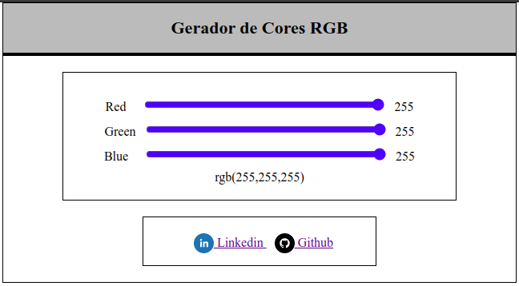
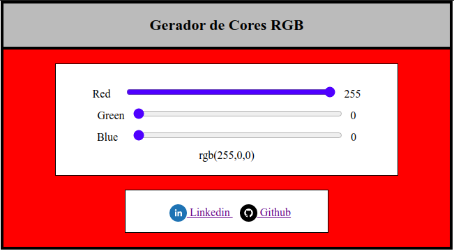
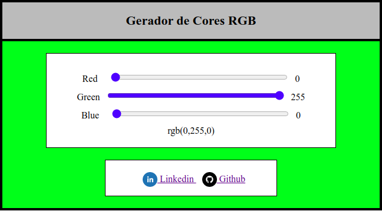
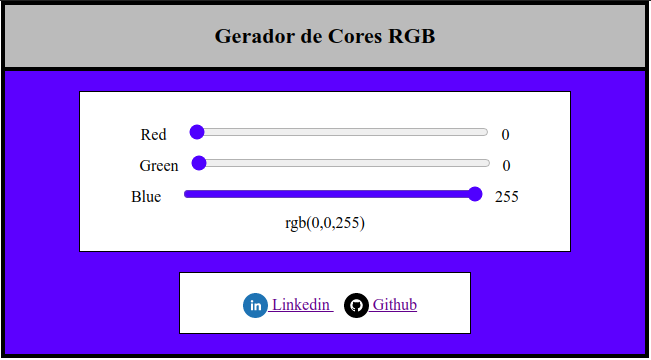

# Gerador de Cores RGB

Projeto simples para manipulação do HTML e CSS sob o especto de cores RGB (Red, Green e Blue) construído usando o framework React.

Além disso esse projeto ainda contém:

* React-router-dom: Manipulador de rotas para renderização de novas paginas;

* Web Componentes: Permitem dividir a interface em partes independentes e reutilizáveis (Component: Header).

### Para executar o projeto no nodeJS:
```
npm start
```

# 
### Branco:

### Vermelho:

### Verde:

### Azul:
